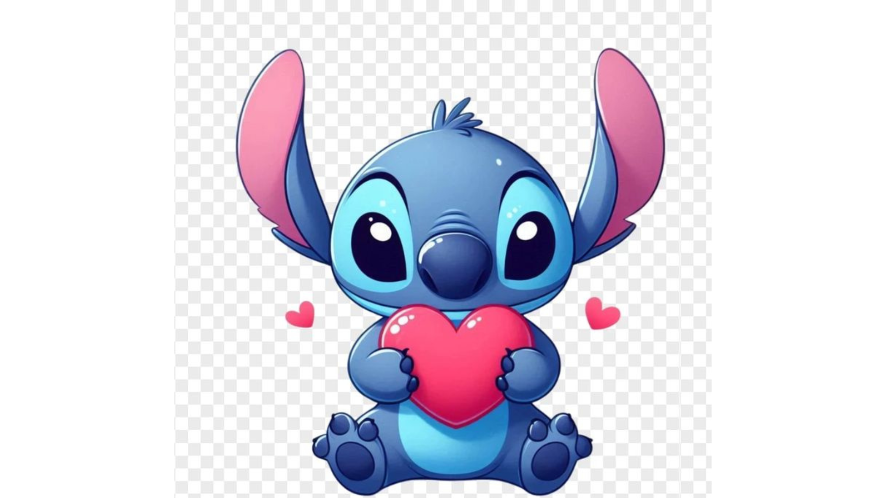
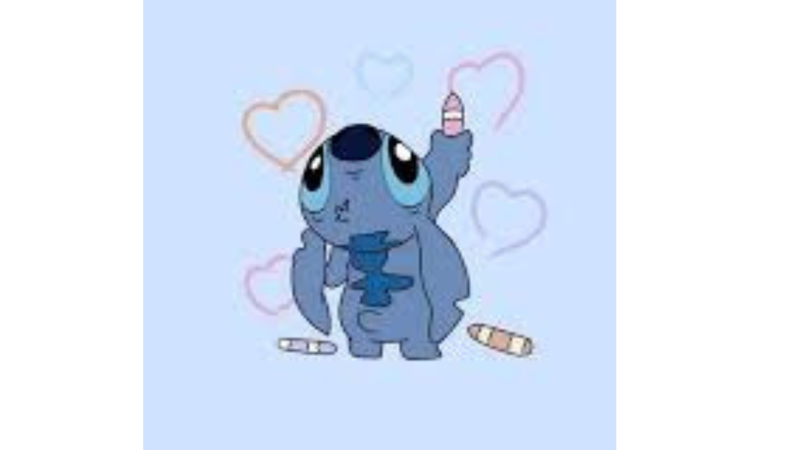

<!DOCTYPE html>
<html lang="en">
<head>
  <meta charset="UTF-8">
  <title>Invitation for Ara</title>
  
</head>
<body>

  <h1>Ara, will you go on a date with me?</h1>
  

  

    <button id="yesBtn">Yes</button>
    <button id="noBtn">No</button>
  

  

  <!-- Final scene after Yes -->
  

    
    
"Let all that you do be done in love." – 1 Corinthians 16:14

  

  <audio id="music" src="https://ia801603.us.archive.org/3/items/AmazingGrace_201303/AmazingGrace.mp3"></audio>

  
</body>
</html>
